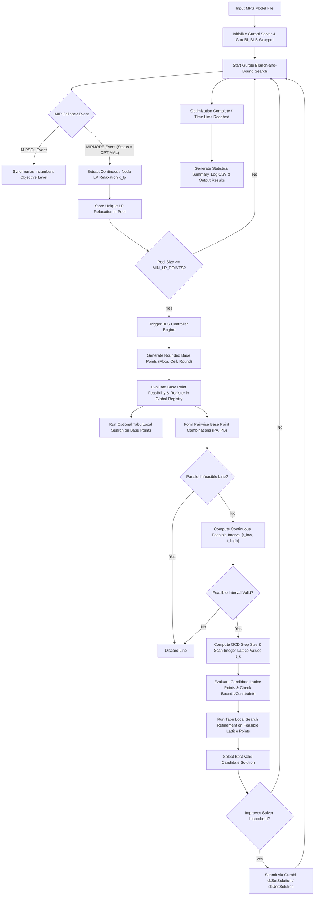

# Branch-Line-Search (BLS) Heuristic Framework for Gurobi

A **Branch-Line-Search (BLS)** heuristic framework for Mixed Integer Programming (MIP) problems, integrated directly with the **Gurobi Optimizer** via custom MIP callbacks.

The framework intercepts continuous Linear Programming (LP) relaxations at Gurobi search tree nodes, rounds fractional variable components into integer base points, constructs parametric 1D line directions between base point pairs, analytically calculates continuous feasibility intervals, scans integer lattice points using Greatest Common Divisor (GCD) steps, and refines candidates via Tabu Local Search (TLS) before injecting accepted feasible solutions back into Gurobi's solver engine.

---

## Table of Contents

- [Overview](#overview)
- [Problem Description](#problem-description)
- [Objective](#objective)
- [Approach &amp; Methodology](#approach--methodology)
- [End-to-End Workflow](#end-to-end-workflow)
- [Major Concepts Used](#major-concepts-used)
- [How the System Works (BLS Implementation)](#how-the-system-works-bls-implementation)
  - [1. Candidate &amp; Solution Representation](#1-candidate--solution-representation)
  - [2. LP Relaxation Extraction &amp; Pooling](#2-lp-relaxation-extraction--pooling)
  - [3. Multi-Mode Base Point Rounding](#3-multi-mode-base-point-rounding)
  - [4. Global Base Point Registry &amp; Pairwise Line Setup](#4-global-base-point-registry--pairwise-line-setup)
  - [5. Continuous Feasibility Interval Math](#5-continuous-feasibility-interval-math)
  - [6. Parallel Infeasibility Early Pruning](#6-parallel-infeasibility-early-pruning)
  - [7. Integer Lattice Scanning via GCD](#7-integer-lattice-scanning-via-gcd)
  - [8. Tabu Local Search (TLS) Refinement](#8-tabu-local-search-tls-refinement)
  - [9. Candidate Evaluation &amp; Objective Computation](#9-candidate-evaluation--objective-computation)
  - [10. Solution Comparison &amp; Gurobi Incumbent Submission](#10-solution-comparison--gurobi-incumbent-submission)
- [Project Structure](#project-structure)
  - [Detailed File &amp; Functionality Reference](#detailed-file--functionality-reference)
- [Output &amp; Results](#output--results)
- [How to Run the Project](#how-to-run-the-project)
  - [Prerequisites](#prerequisites)
  - [Installation &amp; Setup](#installation--setup)
  - [Running Single MPS Instance](#running-single-mps-instance)
- [Configuration Reference](#configuration-reference)
- [Limitations](#limitations)
- [Conclusion](#conclusion)

---

## Overview

Mixed Integer Programming (MIP) problems are fundamental in operations research, logistics, finance, and engineering. Solving large-scale MIP instances using exact Branch-and-Bound algorithms can be computationally intensive because the decision space grows exponentially with the number of integer variables.

The **Branch-Line-Search (BLS)** framework addresses this challenge by acting as a efficient "shortcut" built directly into Gurobi's optimization loop.

Here is how it accelerates the process:

- **Geometric Line Search ($n$-dimensional space)**: Instead of guessing random integer combinations, BLS takes the fractional solutions generated by Gurobi, rounds them, and draws continuous mathematical "lines" between them. It analytically calculates where these lines intersect the valid feasibility region of your problem.
- **Local Neighborhood Exploration**: Once it finds a valid continuous segment on that line, it systematically scans it for integer points. It then refines these candidates (using Tabu Search) by tweaking individual variables up or down to find the best possible local solution.
- **Early Discovery & Pruning**: By discovering these valid integer solutions BLS provides Gurobi with a tight "incumbent bound." This allows Gurobi to aggressively prune (discard) huge, unpromising branches of the search tree, drastically speeding up the overall time to convergence.

---

## Problem Description

A standard Mixed Integer Linear Program (MILP) is expressed in the following general form:

$$
\begin{aligned}
\min \quad & c^T x + c_0 \\
\text{subject to} \quad & A \cdot x \le b \\
& lb \le x \le ub \\
& x_j \in \mathbb{Z} \quad \forall j \in I
\end{aligned}
$$

Where:

- $x \in \mathbb{R}^n$ is the vector of decision variables.
- $I \subseteq \{1, \dots, n\}$ is the set of variable indices constrained to integer values.
- $A \in \mathbb{R}^{m \times n}$ is the linear constraint matrix and $b \in \mathbb{R}^m$ is the right-hand side vector.
- $lb, ub \in \mathbb{R}^n$ represent variable lower and upper bounds.
- $c \in \mathbb{R}^n$ is the objective cost vector and $c_0$ is the objective constant.

Exact MIP solvers solve continuous LP relaxations at tree nodes. However, rounding fractional LP relaxation values independently often yields infeasible points due to complex linear constraints $A \cdot x \le b$. BLS overcomes this by finding valid continuous line segments between rounded base points where linear constraints are satisfied simultaneously, then sampling valid integer coordinates along those segments.

---

## Objective

The core goals of the BLS project are:

1. **Accelerate Incumbent Discovery**: Find feasible integer solutions early during the Gurobi Branch-and-Bound tree search.
2. **Exploit LP Relaxation Geometry**: Leverage continuous optimal LP relaxation points collected across tree nodes to construct promising search directions in variable space.
3. **Analytical Constraint Satisfaction**: Use exact linear algebra to compute continuous feasibility intervals along line directions without expensive trial-and-error constraint evaluations.
4. **Lattice & Local Neighborhood Search**: Systematically scan valid integer lattice points along continuous lines and refine them using Tabu Local Search (TLS).
5. **Seamless Gurobi Integration**: Submit accepted heuristic solutions directly back to Gurobi using native MIP callback hooks (`cbSetSolution` / `cbUseSolution`).

---

## Approach & Methodology

BLS operates as an dynamic heuristic engine connected to Gurobi's solver pipeline via MIP callbacks. The methodology follows four main principles:

1. **Callback Interception**: The framework listens to Gurobi's `MIPNODE` callback events. When Gurobi solves a continuous LP relaxation at a search node, BLS extracts the relaxation solution vector $x_{lp}$.
2. **Multi-Mode Base Point Rounding**: Fractional integer variable components in $x_{lp}$ are converted into integer base points using three distinct rounding strategies (`floor`, `ceil`, and `round`), clamped strictly within variable lower and upper bounds ($lb \le x \le ub$).
3. **Parametric 1D Line Search**: Pairwise combinations of unique historical base points $(P_A, P_B)$ form 1D parametric lines: $P(t) = P_A + t \cdot (P_B - P_A)$. The continuous interval $t \in [t_{low}, t_{high}]$ where all matrix constraints $A \cdot P(t) \le b$ hold is solved analytically.
4. **Lattice Scanning & Tabu Refinement**: Integer lattice points $t_k$ along valid intervals are scanned using Greatest Common Divisor (GCD) steps. Scanned feasible points undergo Tabu Local Search (1-variable integer flips $\pm 1$) to escape local minima, and accepted solutions are submitted to Gurobi.

---

## End-to-End Workflow

The complete execution flow from input instance to final results is illustrated below:



---

## Major Concepts Used

To help non-experts understand the technical foundation of BLS, key concepts are defined below:

- **Mixed Integer Programming (MIP)**: Optimization models where some or all decision variables are restricted to integer values.
- **LP Relaxation**: A simplified subproblem where integer constraints are temporarily ignored, allowing decision variables to take continuous fractional values. Solved quickly at each node of a search tree.
- **Branch-and-Bound**: An exact algorithm that recursively splits (branches) the MIP solution space into smaller subproblems and uses LP bounds to eliminate non-optimal regions.
- **Incumbent Solution**: The best feasible integer solution found so far during the optimization run.
- **Parametric 1D Line**: A straight ray passing through two points $P_A$ and $P_B$ in $n$-dimensional space, parameterized by a scalar step $t$: $P(t) = P_A + t \cdot (P_B - P_A)$. When $t=0$, $P(0)=P_A$; when $t=1$, $P(1)=P_B$.
- **Feasibility Interval ($[t_{low}, t_{high}]$)**: The continuous numerical range of $t$ for which all linear model constraints $A \cdot P(t) \le b$ and variable bounds $lb \le P(t) \le ub$ are simultaneously satisfied.
- **Greatest Common Divisor (GCD) Lattice Scanning**: A mathematical technique to ensure that step increments along a direction vector $\mathbf{d} = P_B - P_A$ hit integer coordinate grid points. The step size is governed by $\Delta_{gcd} = \gcd_i (|\mathbf{d}_i|)$.
- **Tabu Local Search (TLS)**: A neighborhood search technique that modifies integer variables by $\pm 1$. It uses short-term memory (a tabu list) to forbid reversing recent variable modifications, preventing the search from getting stuck in local cycles.
- **Aspiration Criterion**: A rule in Tabu Search that allows a move to override its "tabu" forbidden status if the resulting solution strictly improves the overall best objective found so far.

---

## How the System Works (BLS Implementation)

This section details the exact implementation of BLS within the project codebase.

### 1. Candidate & Solution Representation

Solutions and candidates are represented as 1D NumPy floating-point arrays of length $n$ (matching model variable count). Non-continuous variable indices are identified during solver initialization:

```python
integer_indices = [i for i, var in enumerate(model.getVars()) if var.VType != GRB.CONTINUOUS]
```

### 2. LP Relaxation Extraction & Pooling

Inside `bls/solver.py`, the `GuroBI_BLS` wrapper handles solver callbacks. At `GRB.Callback.MIPNODE` events where `MIPNODE_STATUS == GRB.OPTIMAL`, the continuous LP relaxation solution vector is retrieved via `cbGetNodeRel()`. Unique LP solutions are stored in `lp_solution_pool`. When the number of new unique LP relaxations reaches `MIN_LP_POINTS` (currently `3`), BLS search is triggered.

### 3. Multi-Mode Base Point Rounding

Inside `bls/controller.py` and `bls/utils.py`, each LP relaxation vector is converted into candidate base points by applying three integer rounding functions to `integer_indices`:

- `floor`: Rounds fractional integer variables down to $\lfloor x_i \rfloor$.
- `ceil`: Rounds fractional integer variables up to $\lceil x_i \rceil$.
- `round`: Rounds fractional integer variables to nearest integer $\lfloor x_i + 0.5 \rfloor$.

All rounded components are clamped to variable lower and upper bounds ($lb_i \le x_i \le ub_i$).

### 4. Global Base Point Registry & Pairwise Line Setup

Generated base points are registered in `global_base_points`. For all pairwise combinations of registered base points $(P_A, P_B)$, a `LineSearch` instance (`bls/line_search.py`) defines the direction vector:

$$
\mathbf{d} = P_B - P_A
$$

Duplicate line combinations processed in prior callback rounds are skipped using boundary tracking (`last_evaluated_registry_size`).

### 5. Continuous Feasibility Interval Math

Instead of testing thousands of points individually to see if they break any rules, `BLSController.feasible_t_interval()` mathematically calculates exactly how far we can travel along our line before hitting a constraint boundary. It computes a continuous valid range, called $[t_{low}, t_{high}]$, where $t$ is our step size.

For every rule (constraint) in the optimization problem, the algorithm evaluates:

1. **Where we are now** (Current Activity: $\alpha_k$)
2. **How fast we are moving** (Rate of Change / Slope: $\beta_k$)
3. **What the absolute limit is** (The Rule Limit: $b_k$)

The core logic checks:
**(Current Activity) + (Step Size $\times$ Rate of Change) $\le$ (Rule Limit)**

Formally, for every constraint row $k$ with activity $\alpha_k = (A P_A)_k$ and slope $\beta_k = (A \mathbf{d})_k$, the linear inequality is evaluated:

$$
\alpha_k + t \cdot \beta_k \le b_k \implies t \cdot \beta_k \le b_k - \alpha_k
$$

By solving this simple equation, the algorithm finds the inequality root $t_{root} = (b_k - \alpha_k) / \beta_k$. This root instantly tells the algorithm the maximum (or minimum) number of steps it can take without breaking that specific rule:

- If $\beta_k > 0$, $t \le t_{root} \implies t_{high} = \min(t_{high}, t_{root})$.
- If $\beta_k < 0$, $t \ge t_{root} \implies t_{low} = \max(t_{low}, t_{root})$.
- Variable bounds ($lb \le P(t) \le ub$) are restricted similarly.

It does this for every single rule in the problem, taking the most restrictive limits to perfectly define the safe $[t_{low}, t_{high}]$ boundaries where valid integer solutions might exist.

If $t_{low} > t_{high}$, the line does not intersect the feasible region and is immediately discarded.

### 6. Parallel Infeasibility Early Pruning

`BLSController.should_discard_parallel_infeasible()` checks if a line direction is parallel to constraint hyperplanes ($\beta_k = 0$) while lying outside constraint slacks ($\alpha_k > b_k$). Such lines are pruned instantly before interval calculation.

### 7. Integer Lattice Scanning via GCD

To find integer-valued points along the continuous line, `BLSController.lattice_t_values()` calculates the Greatest Common Divisor across direction integer components:

$$
\Delta_{gcd} = \gcd_{i \in I} (|\mathbf{d}_i|)
$$

Step values $t_k = k / \Delta_{gcd}$ for integers $k$ guarantee that integer variables remain integers. Step values within $[t_{low}, t_{high}]$ are sampled up to `BLS_MAX_CANDIDATES` (currently `200`).

#### Why compute the GCD? A Simple Example

Suppose we have a BLS line defined as $P(t) = P_A + t \cdot \mathbf{d}$.
Let our starting base point be $P_A = [2, 5]$ and our direction vector be $\mathbf{d} = [6, 4]$.

Every point on the line is defined by:

- $x_1 = 2 + 6t$
- $x_2 = 5 + 4t$

Assuming both $x_1$ and $x_2$ are constrained to be integer variables, we need to know what step sizes ($t$) will guarantee both variables remain integers. Since the starting point $[2, 5]$ is already an integer, this means we only need the steps $6t$ and $4t$ to yield integers.

If we test some fractional values for $t$:

- $t = 1 \implies [6(1), 4(1)] = [6, 4]$ (Valid integers)
- $t = 1/2 \implies [6(1/2), 4(1/2)] = [3, 2]$ (Valid integers)
- $t = 1/3 \implies [6(1/3), 4(1/3)] = [2, 1.33]$ (Invalid, $x_2$ is fractional)
- $t = 1/4 \implies [6(1/4), 4(1/4)] = [1.5, 1]$ (Invalid, $x_1$ is fractional)

Notice that only multiples of $1/2$ work. This is exactly because the **Greatest Common Divisor (GCD)** of the direction components $[6, 4]$ is **$2$**.

**Example 2:**
If our direction vector was $\mathbf{d} = [9, 6]$, the $\gcd(9, 6) = 3$.
Therefore, the valid step sizes would be $t = k/3$ (where $k$ is any integer).

- $t = 1/3 \implies [9(1/3), 6(1/3)] = [3, 2]$ (Valid)
- $t = 2/3 \implies [9(2/3), 6(2/3)] = [6, 4]$ (Valid)
- $t = 1/2 \implies [9(1/2), 6(1/2)] = [4.5, 3]$ (Invalid)

By calculating $\Delta_{gcd}$ upfront, the algorithm avoids testing millions of invalid fractional steps and perfectly jumps from one valid integer lattice point to the next!

### 8. Tabu Local Search (TLS) Refinement

When `USE_TABU_LOCAL_SEARCH = True`, `BLSController.tabu_local_search()` performs local neighborhood refinement on feasible base and lattice points:

- **Neighborhood**: 1-flip moves ($\pm 1$) on integer variable indices.
- **Tabu List**: Variable index modification is forbidden for `TABU_TENURE` steps (currently `5`).
- **Aspiration Override**: Tabu restrictions are bypassed if a move yields an objective strictly better than `best_objective`.
- **Termination**: Stops after `TABU_MAX_STEPS` (currently `15`) or when no non-tabu feasible moves remain.

### 9. Candidate Evaluation & Objective Computation

Candidate feasibility is verified by `is_feasible(point)`:

1. Variable bounds check: $lb_i - \epsilon \le x_i \le ub_i + \epsilon$.
2. Matrix constraint check: $A \cdot x \le b + \epsilon$ (using numerical tolerance $\epsilon = 10^{-6}$).

The objective value is computed by `objective_value(point)`:

$$
\text{Objective} = c^T x + c_0
$$

### 10. Solution Comparison & Gurobi Incumbent Submission

Solutions are compared using `_is_better(obj_new, obj_old)` considering model sense (minimization vs maximization) and numerical tolerance `EPS`:

- Minimization: `obj_new < obj_old - EPS`
- Maximization: `obj_new > obj_old + EPS`

Candidates beating the current solver incumbent are submitted to Gurobi via `submit_solution()` using `cbSetSolution(vars, values)` and `cbUseSolution()`. Duplicate submissions are prevented by coordinate hashing (`_get_point_hash`). Accepted solutions update Gurobi's incumbent and tighten branch-and-bound cutoffs.

---

## Project Structure

```
bls_expr/
├── bls/                          # Core BLS Heuristic Package
│   ├── __init__.py               # Package exports and public API definitions
│   ├── __main__.py               # Runnable module entry point (python -m bls)
│   ├── config.py                 # Central configuration, paths, and hyperparameters
│   ├── controller.py             # BLS engine, interval math, lattice scanning & Tabu LS
│   ├── line_search.py            # 1D line geometry representation class
│   ├── main.py                   # CLI executable script for optimizing MPS instances
│   ├── miplib_solutions.py       # MIPLIB solu dataset parser, web scraper & JSON cache
│   ├── solver.py                 # GuroBI_BLS callback wrapper backend
│   ├── utils.py                  # Integer component rounding & bound clamping utilities
│   └── data/                     # Directory storing solu benchmark files & JSON solution cache
├── miplib_instances/             # Directory containing input MPS benchmark instances
├── results/                      # Output directory for run statistics (run_stats.csv)
└── README.md                     # Professional GitHub Project Documentation
```

## Detailed File & Functionality Reference

### 1. `bls/config.py` — Central Configuration

Contains all path specifications, solver flags, and algorithm hyperparameters.

- **Path Constants**:
  - `PROJECT_DIR`: Points to project root directory.
  - `INSTANCE_DIR`: Points to MPS instance directory (`miplib_instances/instances`).
  - `RESULT_DIR`: Points to output results folder (`results/`).
  - `INSTANCE_PATH`: Target MPS file path, constructed from `INSTANCE_DIR / INSTANCE_NAME` (currently `example.mps`).
- **Gurobi Solver Parameters**:
  - `TIME_LIMIT` (`600`s): Global execution cutoff for BLS solver runs.
  - `GUROBI_BASELINE_TIME_LIMIT` (`600`s): Cutoff for baseline pure Gurobi runs.
  - `THREADS` (`1`): Number of Gurobi solver threads.
  - `OUTPUT_FLAG` (`1`): Gurobi console logging flag.
  - `SEED` (`1`): Random seed for reproducibility.
  - `NUMERIC_FOCUS` (`2`): Gurobi numeric focus setting.
  - `MIP_GAP` (`0.0`): Target MIP gap termination condition.
  - `EPS` (`1e-6`): Tolerance threshold for feasibility and numerical equality checks.
- **BLS Algorithm Hyperparameters**:
  - `USE_BLS` (`True`): Toggles BLS heuristic callback execution.
  - `VERBOSE` (`True`): Enables detailed console diagnostic logging.
  - `MIN_LP_POINTS` (`3`): Number of new unique LP relaxations required to trigger a BLS search round.
  - `BLS_MAX_CANDIDATES` (`200`): Maximum candidate lattice points evaluated per line search.
  - `BLS_MAX_EXTENSION` (`10`): Maximum extension boundary for unbounded line searches.
  - `CALCULATE_CENTROIDS` (`False`): Enables overall batch rounded centroid registration.
  - `USE_MIPLIB_SOLUTIONS` (`False`): Toggles MIPLIB reference solution lookup.
  - `SAVE_CSV_STATISTICS` (`True`): Saves run statistics to `results/run_stats.csv` after each run.
- **Tabu Local Search Parameters**:
  - `USE_TABU_LOCAL_SEARCH` (`False`): Activates 1-flip integer neighborhood local search.
  - `TABU_MAX_STEPS` (`15`): Maximum steps per Tabu Local Search execution.
  - `TABU_TENURE` (`5`): Iteration tenure during which modified variables remain forbidden.

---

### 2. `bls/line_search.py` — 1D Parametric Line Representation

Defines the 1D ray geometry passed between two points in $n$-dimensional variable space.

#### Class `LineSearch`

- **Attributes**:
  - `direction`: Direction vector $\mathbf{d} = P_B - P_A$.
  - `RA`: Base point $P_A$ (NumPy array).
  - `RB`: Base point $P_B$ (NumPy array).
  - `lp_id_A`, `lp_id_B`: Metadata tracking source LP solution IDs for logging.
- **Methods**:
  - `set_base_points(RA, RB, lp_id_A=None, lp_id_B=None)`: Computes direction vector $\mathbf{d} = P_B - P_A$ and stores base point arrays.
  - `point(t)`: Computes $P(t) = P_A + t \cdot (P_B - P_A)$ for any scalar step $t$.

---

### 3. `bls/utils.py` — Integer Rounding & Bound Enforcement

Provides variable rounding algorithms respecting lower (`lb`) and upper (`ub`) bounds.

#### Function `round_integer_part(point, integer_indices, mode='floor', lb=None, ub=None)`

- **Parameters**:
  - `point`: Input coordinate vector.
  - `integer_indices`: List of variable indices subject to integer constraints.
  - `mode`: Rounding mode (`'floor'`, `'ceil'`, `'round'`).
  - `lb`, `ub`: Optional arrays specifying variable lower and upper bounds.
- **Returns**: A copy of `point` with specified integer indices rounded and clamped between `lb[idx]` and `ub[idx]`.

---

### 4. `bls/miplib_solutions.py` — Solution Parsing & Online Fetching

Handles optimal objective lookup for benchmark instances from MIPLIB datasets and local JSON caches.

- **Functions**:
  - `normalize_instance_name(name)`: Strips directory paths, file extensions (`.mps`, `.gz`, `.lp`), and duplicate tags (`(1)`).
  - `load_solutions_cache(cache_path)`: Reads persistent `solutions_cache.json` file.
  - `save_solution_to_cache(instance_name, obj_val, status, source, cache_path)`: Writes solved instance objective values to local cache.
  - `parse_solu_file(solu_path)`: Parses standard MIPLIB `.solu` files (`=opt=`, `=best=`, `=inf=`, `=unb=`).
  - `fetch_solution_online(instance_name)`: Scrapes optimal values directly from `miplib.zib.de`.
  - `get_miplib_solution(instance_name, solu_path, cache_path)`: Hierarchical lookup checking `.solu` file $\to$ online web lookup $\to$ local JSON cache.

---

### 5. `bls/solver.py` — Gurobi Callback Solver Backend

Encapsulates Gurobi model setup, callback hook logic, and solution submission.

#### Class `GuroBI_BLS`

- **Initialization (`__init__`)**:
  - Extracts model sense (Minimization / Maximization) and identifies non-continuous variable indices.
  - Instantiates `BLSController`.
  - Initializes tracking metrics (`bls_calls`, `bls_solutions_found`, `bls_improvements`, `lp_solution_pool`).
- **Methods**:
  - `_mip_callback(model, where)`: Gurobi callback method triggered at solver events:
    - `GRB.Callback.MIPNODE`: Checks `MIPNODE_STATUS == GRB.OPTIMAL`, extracts node LP relaxations via `cbGetNodeRel()`, stores unique LP solutions in `lp_solution_pool`, and triggers BLS every `min_lp_points` solutions.
    - `GRB.Callback.MIPSOL`: Synchronizes best incumbent level from Gurobi solution events.
  - `submit_solution(model, candidate)`: Submits valid integer candidate solutions to Gurobi using `cbSetSolution()` and `cbUseSolution()`. Deduplicates candidates using coordinate hashes.
  - `_apply_bls_on_siblings(model)`: Invokes `BLSController.process_siblings()`, retrieves feasible points, selects the best point, and submits it to Gurobi.
  - `solve()`: Executes Gurobi optimization with or without BLS callbacks.
  - `statistics()`: Returns dictionary summarizing run metrics (MIP gap, time, nodes, BLS calls, solutions found, TLS statistics).

---

### 6. `bls/controller.py` — BLS Engine & Tabu Local Search

The core algorithmic controller executing line evaluations, feasibility intervals, and Tabu Local Search.

#### Class `BLSController`

- **Core State & Caching**:

  - `_cache_model_data()`: Caches variable bounds (`lb`, `ub`), constraint matrix $A$, RHS vector $b$, sense operators, and objective vector $c$.
  - `global_base_points`: Registry of all historical base points created across callback rounds.
  - `evaluated_lattice_points`: Hash set preventing duplicate lattice point evaluations.
- **Main Execution Methods**:

  - `process_siblings(lp_pool, cb_model)`:
    1. Rounds each new LP relaxation into `ceil`, `floor`, and `round` candidate base points.
    2. Evaluates base point feasibility and submits the best point per LP relaxation.
    3. Option to execute Tabu Local Search on rounded base points.
    4. Registers unique base points into `global_base_points`.
    5. Evaluates pairwise line combinations $(P_A, P_B)$ using `itertools.combinations`.
    6. Computes optional batch rounded centroids.
  - `search_line()`:
    1. Checks parallel infeasibility (`should_discard_parallel_infeasible()`).
    2. Calculates continuous feasibility interval $[t_{low}, t_{high}]$ (`feasible_t_interval()`).
    3. Calculates valid integer lattice step values $t_k$ (`lattice_t_values()`).
    4. Evaluates lattice points along line, updating incumbent and running TLS refinement.
- **Feasibility & Math Engine**:

  - `feasible_t_interval()`: Solves system of linear inequality constraints $A(P_A + t \cdot \mathbf{d}) \le b$ and variable bounds to return valid continuous interval $[t_{low}, t_{high}]$.
  - `lattice_t_values(low, high)`: Solves GCD step size $\Delta_{gcd} = \gcd_i (|\mathbf{d}_i|)$ to scan valid integer lattice values within interval $[low, high]$.
  - `should_discard_parallel_infeasible()`: Checks if line direction is parallel to constraint hyperplanes while lying entirely outside feasible slack boundaries.
  - `is_feasible(point, t=None)`: Verifies variable bounds and constraint matrix activities $A \cdot x \le b$.
  - `objective_value(t=None, point=None)`: Evaluates linear objective function $c^T x + c_0$.
- **Tabu Local Search (`tabu_local_search(start_point, cb_model)`)**:

  - Explores 1-flip integer neighborhood by stepping each integer variable by $\pm 1$.
  - Maintains `tabu_vars` memory dictionary (`var_index -> tabu_until_step`).
  - **Aspiration Criterion**: Overrides tabu restriction if candidate neighbor strictly improves global `best_objective`.
  - Immediately submits incumbent-improving neighborhood points to Gurobi.

---

### 7. `bls/main.py` — CLI Executable Entry Point

Command-line execution script for solving MPS benchmark instances.

- **Workflow**:
  1. Parses instance path from CLI arguments (`sys.argv[1]`) or falls back to `INSTANCE_PATH` from `config.py`.
  2. Loads MPS model using `gurobipy.read()`.
  3. Configures Gurobi parameters (`OutputFlag`, `Threads`, `Seed`, `NumericFocus`, `MIPGap`, `Heuristics=0`, `Presolve=0`, `Cuts=0`, `RINS=0`, `Symmetry=0`).
  4. Instantiates `GuroBI_BLS` solver wrapper.
  5. Executes optimization run and prints formatted summary statistics table.

---

### 8. Package Modules (`__init__.py` & `__main__.py`)

- **`bls/__init__.py`**: Exposes main package interface symbols (`GuroBI_BLS`, `BLSController`, `LineSearch`, `round_integer_part`, `main`, configuration parameters).
- **`bls/__main__.py`**: Enables direct module execution via `python -m bls [instance.mps]`.

---

## Output & Results

Upon completing an optimization run, the system produces the following outputs:

1. **Console Summary Table**: A formatted key-value summary printed to terminal:
2. **CSV Run Statistics**: Written to `results/run_stats.csv`, recording detailed metrics (instance name, status, best objective, MIP gap, runtime, BLS calls, solutions found, improvements).

---

## How to Run the Project

### Prerequisites

- **Python 3.8+**
- **Gurobi Optimizer** (with valid license installed)
- **Python Packages**: `gurobipy`, `numpy`

Install Python dependencies via pip:

```bash
pip install gurobipy numpy
```

### Installation & Setup

Clone the repository and navigate to the project directory:

```bash
git clone https://github.com/vik1561/BLS_IMPLEMENTATION.git
cd BLS_IMPLEMENTATION
```

### Running Single MPS Instance

To run BLS on the configured instance (currently `example.mps` as set in `config.py`):

```bash
python -m bls
```

To run BLS on a custom MPS instance file:

```bash
python -m bls path/to/instance.mps
```

Alternatively, execute the main script directly:

```bash
python bls/main.py path/to/instance.mps
```

---

## Configuration Reference

All configurable parameters are centralized in `bls/config.py`:

| Parameter                 | Type      | Value     | Description                                                                  |
| :------------------------ | :-------- | :-------- | :--------------------------------------------------------------------------- |
| `TIME_LIMIT`            | `int`   | `600`   | Global cutoff time limit in seconds for solver run.                          |
| `THREADS`               | `int`   | `1`     | Number of threads for Gurobi solver (set to 1 for deterministic evaluation). |
| `OUTPUT_FLAG`           | `int`   | `1`     | Gurobi console logging flag (1 = enabled, 0 = silent).                       |
| `SEED`                  | `int`   | `1`     | Random seed for solver reproducibility.                                      |
| `NUMERIC_FOCUS`         | `int`   | `2`     | Gurobi numeric focus setting to manage numerical precision.                  |
| `MIP_GAP`               | `float` | `0.0`   | Target MIP gap termination threshold.                                        |
| `EPS`                   | `float` | `1e-6`  | Numerical tolerance for feasibility and equality checks.                     |
| `USE_BLS`               | `bool`  | `True`  | Master toggle enabling or disabling BLS callback heuristic.                  |
| `VERBOSE`               | `bool`  | `True`  | Enables detailed console diagnostic logging.                                 |
| `MIN_LP_POINTS`         | `int`   | `3`     | Number of new unique LP relaxations required to trigger a BLS search round.  |
| `BLS_MAX_CANDIDATES`    | `int`   | `200`   | Maximum integer lattice candidate points scanned per line.                   |
| `BLS_MAX_EXTENSION`     | `int`   | `10`    | Maximum extension boundary for unbounded line searches.                      |
| `SAVE_CSV_STATISTICS`   | `bool`  | `True`  | Saves run statistics to`results/run_stats.csv` after each run.             |
| `USE_TABU_LOCAL_SEARCH` | `bool`  | `False` | Enables 1-flip Tabu Local Search refinement around feasible points.          |
| `TABU_MAX_STEPS`        | `int`   | `15`    | Maximum steps per Tabu Local Search execution.                               |
| `TABU_TENURE`           | `int`   | `5`     | Iteration tenure during which modified variables remain forbidden.           |
| `CALCULATE_CENTROIDS`   | `bool`  | `False` | Toggles calculation and registration of batch rounded centroids.             |

---

## Limitations

1. **Numerical Tolerance Sensitivity**: Analytical constraint interval calculations rely on floating-point equality tolerances ($\epsilon = 10^{-6}$). Extremely ill-conditioned matrices may experience minor numerical precision mismatches.
2. **Pairwise Combination Scaling**: The number of base point line combinations grows quadratically $O(N^2)$ with the size of the global base point registry (e.g., 100 points = 4,950 lines to draw). The algorithm mitigates this performance hit by intelligently skipping duplicate combinations that were evaluated in previous rounds. It achieves this by storing the previous registry size (`n_old`) and simply verifying if `idx_A < n_old and idx_B < n_old`. If both points existed in the previous round, the line is instantly skipped, restricting heavy computation strictly to combinations involving newly discovered points.
3. **LP Relaxation Diversity Dependence**: The quality of generated line search directions depends on Gurobi producing diverse continuous LP relaxation vectors at branch-and-bound nodes.

---

## Conclusion

The **Branch-Line-Search (BLS)** framework provides an effective, domain-independent heuristic approach for solving Mixed Integer Programming problems. By extracting LP relaxation geometry from Gurobi branch-and-bound nodes, constructing continuous 1D feasibility intervals, scanning integer lattice points via GCD steps, and refining candidates with Tabu Local Search, BLS discovers feasible integer solutions early in the search process. Integrated directly into Gurobi via native callbacks, BLS tightens solver bounds and accelerates overall optimization performance.

---

## Acknowledgements

This research was conceptualized, directed, and supervised by:

**[Dr. Md. Shahrukh Anjum](https://ahduni.edu.in/faculty/md-shahrukh-anjum/)**
Faculty, School of Engineering and Applied Science
Ahmedabad University, Ahmedabad, India

The foundational idea of the **Branch-Line-Search (BLS)** framework — embedding a geometric line search heuristic directly inside Gurobi's branch-and-bound callback pipeline — originates from his research direction. The implementation in this repository was developed as part of research work conducted under his guidance at Ahmedabad University.

---

**Implementation by:**

**[Vikash Kumar](https://www.linkedin.com/in/vikash-kumar-ms/)**
